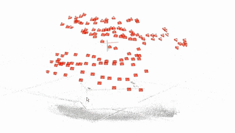
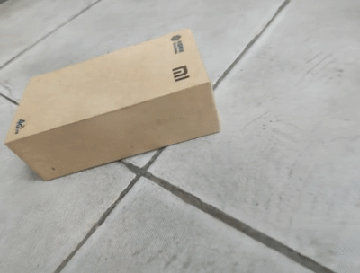

# Final Project of "Neural Network and Deep Learning"

-----

Table of Contents
=================

* [This is the task 2 of final project of "Neural Network and Deep Learning"](#this-is-the-final-project-of-neural-network-and-deep-learning)
   * [Introduction](#introduction)
   * [Task 1](#task-1)
   * [Task 2](#task-2)
   * [Task 3](#task-3)

## Introduction

The project is the final project of **DATA620004**. 
In this project, we have three tasks:
- Task 1: Compare supervised learning and self-supervised learning on CIFAR-100 classification
- Task 2: compare Transformer-based and CNN-based image classification models on CIFAR-100
- Task 3: Object Reconstruction and Novel View Synthesis based on NeRF

Next, we briefly introduce each task and some important results.
Other detailed descriptions and guides are left in the README of the directory for each task.

## Task 1

In this task, we compare the following three methods for training ResNet-18 on CIFAR-100.
- **Self-supervised pretrain** on ImageNet (SimCLR with ResNet-18) + supervised train fro the last linear layer on CIFAR-100
- **Supervised pretrain** on ImageNet (ResNet-18) + supervised train for the last linear layer on CIFAR-100
- **Supervised train** on the full ResNet-18 model on CIFAR-100

results: TODO

Please refer to [README of task 1](./task1/README.md) for more details.

## Task 2

In this task, we compare the following two methods for training classification models on CIFAR-100.
- **CNN-based model**: ResNet-18
- **Transformer-based model**: ViT

We use data augmentation strategies including **Mixup**, **Cutmix** and **Cutout** during training, and tune the hyper-parameters for each model.
When ResNet-18 and ViT has similar number of parameters (11,220,132 v.s. 11,146,564) with the best hyper-parameters, the test accuray of ResNet-18 is 78.26%, but ViT is only 53.78%.

Please refer to [README of task 2](./task2/README.md) for more details.

## Task 3

In this task, we take 131 multi-angle images, and use  **COLMAP** for preprocessing, then transform 3D-related information into LLFF data.
Finally, we use **NeRF** model to train and render the video, in which 5 images are set as test set.

The final **PSNR** in test images is 30.82.
The outputs of COLMAP and NeRF are shown as follows.

Please refer to [README of task 3](./task3/README.md) for more details.